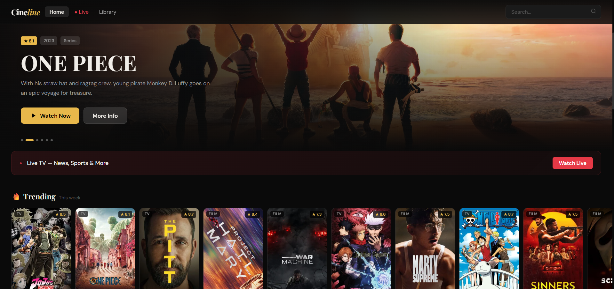
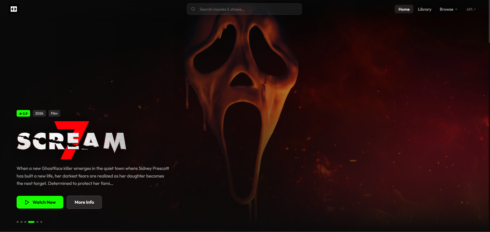
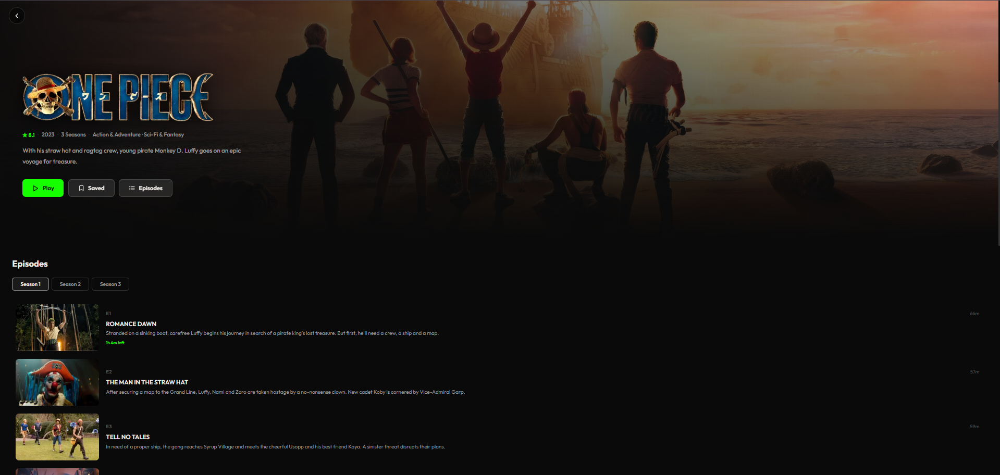
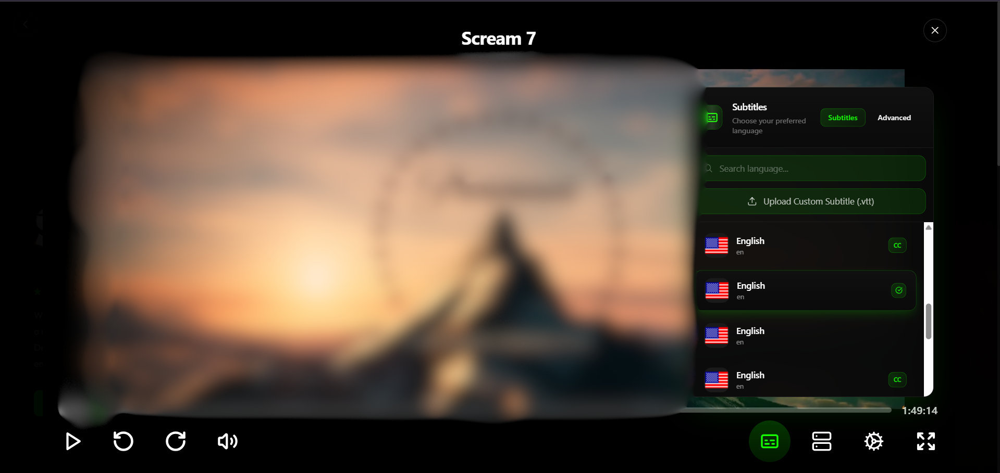
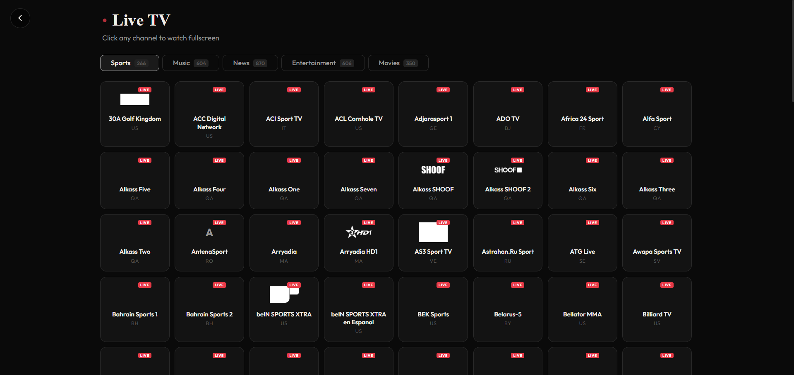
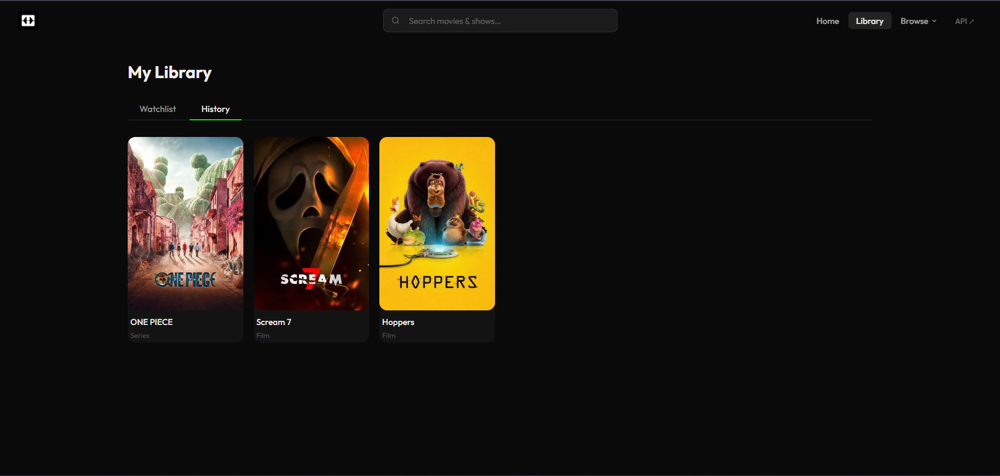
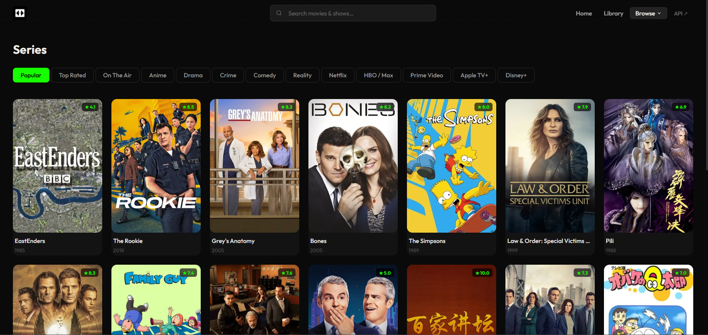
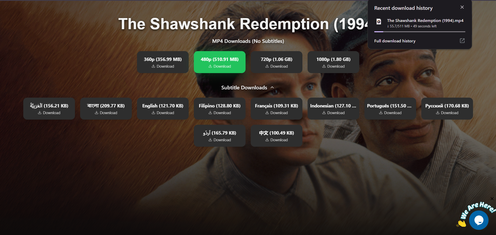

# Zentro

  

A clean, fast streaming frontend for movies, TV series, and live TV.  
Powered by [TMDB](https://www.themoviedb.org/) for metadata, [Vidking](https://www.vidking.net/) for playback, and [iptv-org](https://github.com/iptv-org/iptv) for live channels.

---

## Features
- A unified interface for Movies, Series, and HLS Live TV streams.
- Integrated Ad-Blocker & Popup Interceptor to neutralize third-party tracking and intrusive redirects.
- Locally stored Watchlist and History.
- Good UI

---

## Screenshots
1. Home

2. Movie

3. Series

4. Player

5. Live TV

6. Library

7. Browse

8. Download

## Disclaimer
**Note:** Zentro is a frontend interface only. This project does not host, store, or distribute any media files.
* Playback: Powered by the [Vidking API](https://www.vidking.net/).
* Downloads: Handled via [Vidvault](https://vidvault.ru/).

All content is provided by third-party services. For any DMCA or legal inquiries, please contact the respective API providers directly.