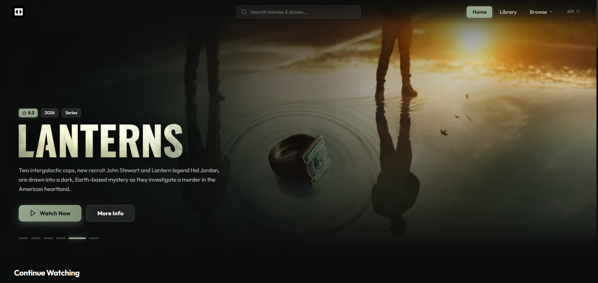
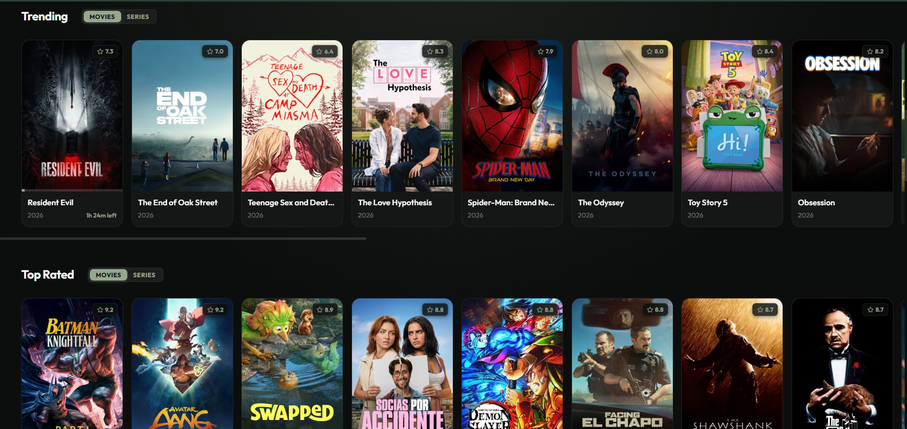
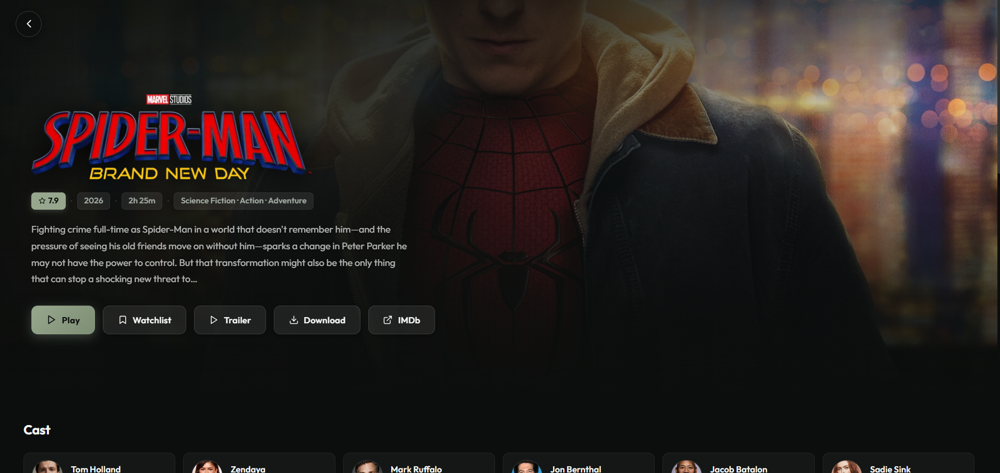
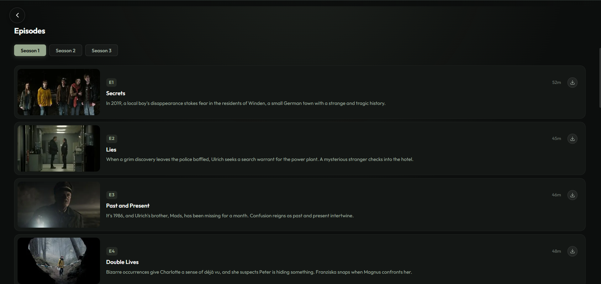
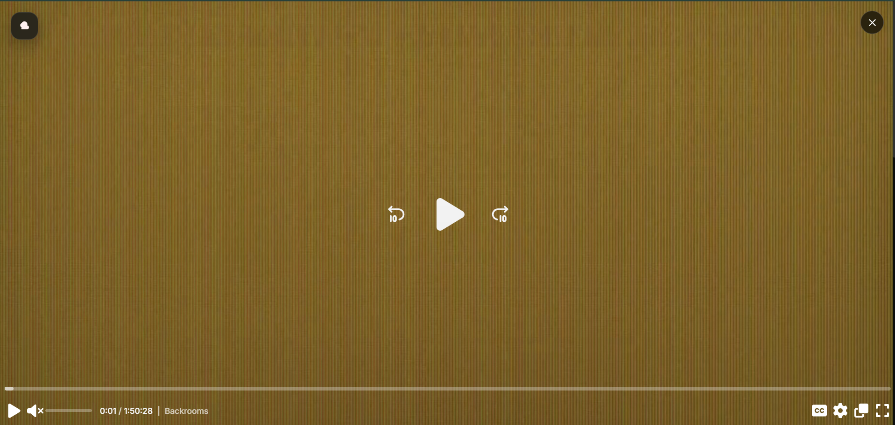
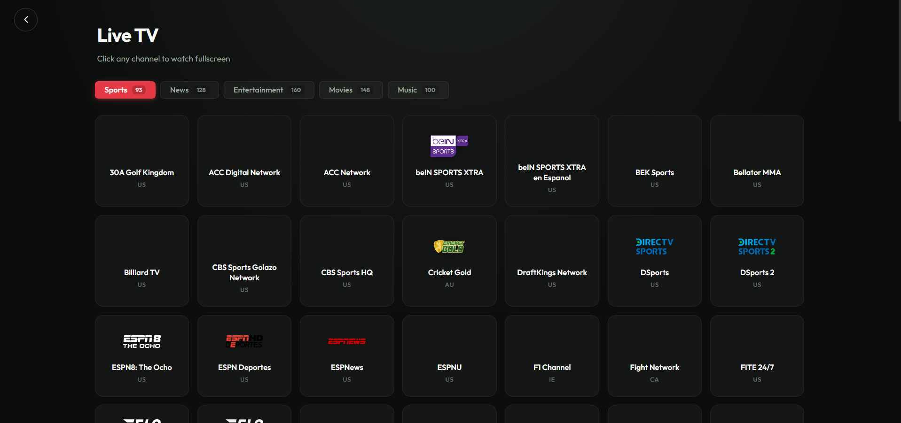
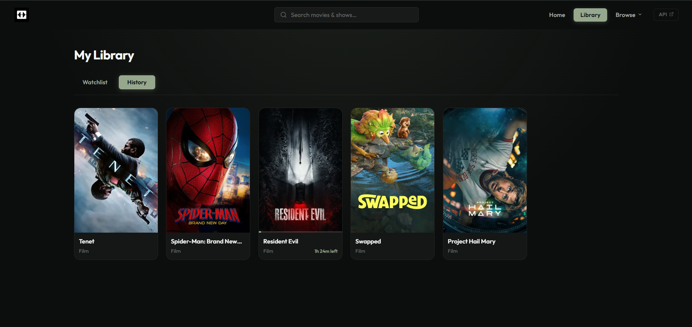
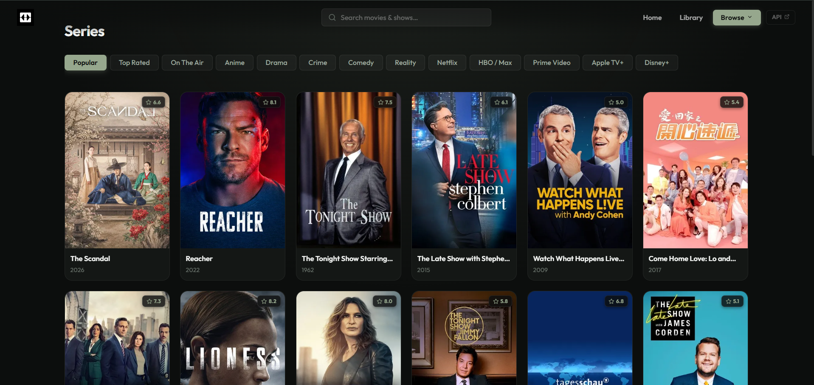
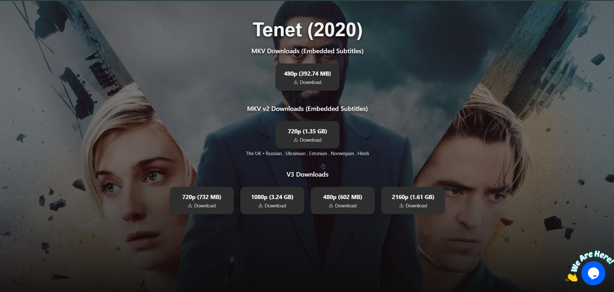

# Zentro

  

A clean, fast streaming frontend for movies, TV series, and live TV.  
Powered by [TMDB](https://www.themoviedb.org/) for metadata, [Vidphantom](https://vidphantom.com) for playback, and [iptv-org](https://github.com/iptv-org/iptv) for live channels.

---

## Features
- A unified interface for Movies, Series, and HLS Live TV streams.
- Locally stored Watchlist and History.
- Good UI

* _Adblocking: Couldn't fix adblocker due to detection and stuff so use an external adblocker until a solution is found_
---

## Screenshots
1. Hero

2. Home

3. Movie details

4. Series

4. Player

6. Live TV

7. Library

8. Browse

9. Download

## Disclaimer
**Note:** Zentro is a frontend interface only. This project does not host, store, or distribute any media files.
* Playback: Powered by the [Vidphantom API](https://vidphantom.com).
* Downloads: Handled via [Vidvault](https://vidvault.ru/).

All content is provided by third-party services. For any DMCA or legal inquiries, please contact the respective API providers directly.
